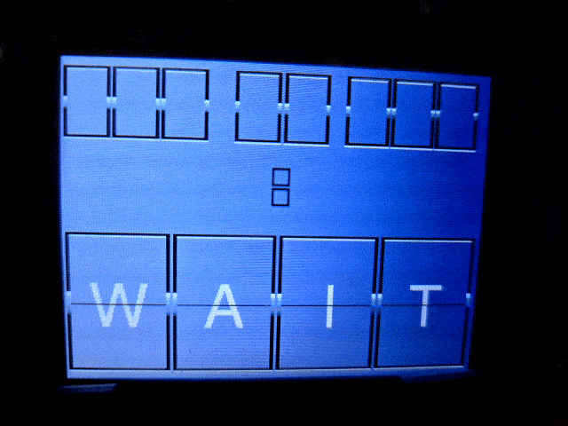

# Flip Clock on a Cheap Yellow Display (CYD)
This program uses a Cheap Yellow Display to show a classic flip clock.  The design is based on Jeremy Cook's [Simulated Flip Clock](https://github.com/funnypolynomial/FlipClock), but I've updated the code to use modern libraries and a CYD. **Note:** Touch the screen to force a flip.

## Requirements

You'll need a Cheap Yellow Display (CYD).

CYD (part ESP32-2432S028R) is an ESP32 with a a built-in 2.8" LCD display (240x320) touchscreen. More information is available [here](https://github.com/witnessmenow/ESP32-Cheap-Yellow-Display) and from [Random Nerds](https://randomnerdtutorials.com/projects-esp32/). 

## Dependencies

This project requires the following libraries.

**[TFT_eSPI](https://github.com/Bodmer/TFT_eSPI)**
Arduino and PlatformIO IDE compatible TFT library optimized for the Raspberry Pi Pico (RP2040), STM32, ESP8266 and ESP32 that supports different driver chips.

**[XPT2046_Touchscreen](https://github.com/PaulStoffregen/XPT2046_Touchscreen)**
Touchscreen Arduino Library for XPT2046 Touch Controller Chip. Even though TFT_eSPI provides some support for touchscreens, it doesn't work on the CYD, so you need this for touchscreen functions. **Note:** If you are using PlatformIO, you must configure the library in the platformio.ini by pointing to the official [repo](https://github.com/PaulStoffregen/XPT2046_Touchscreen.git) or manually downloading the lib. The library included by PlatformIO is out of date.

## Visual Studio Code/Platformio vs Arduino IDE
The source is configured to use platformio.ini to configure settings for TFT_eSPI.  To configure these settings under Arduino IDE, copy the [User_Setup.h](https://raw.githubusercontent.com/RuiSantosdotme/ESP32-TFT-Touchscreen/main/configs/User_Setup.h) from Random Nerds to your TFT_eSPI folder under your Arduino\libraries. Details are at [Random Nerds CYD Tutorial](https://randomnerdtutorials.com/cheap-yellow-display-esp32-2432s028r/). For my CYD, I had to add ` #define TFT_INVERSION_ON`.
